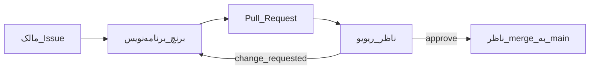

# جریان گیت‌هاب سه‌نفره

مخزن: [github.com/Erfuni/sozan](https://github.com/Erfuni/sozan) — شاخهٔ پایه `main`.

تبلیغات و ایده در Grok Bot می‌مانند. اگر به کد نیاز شد فقط Issue باز می‌کنند؛ دسترسی Write به `main` نمی‌گیرند.

## نقش‌ها

| نقش | چه می‌کند | چه نمی‌کند |
| --- | --- | --- |
| مالک محصول | Issue، اولویت، تأیید Done از نظر محصول | پوش یا merge مستقیم به `main` |
| برنامه‌نویس (Cursor) | برنچ، کد، تست، بند CHANGELOG در همان PR | merge |
| ناظر کد | ریویو خط‌به‌خط، Approve، **تنها merge** | رد کردن ریویو و زدن merge |

در [`.github/CODEOWNERS`](../.github/CODEOWNERS) الان `@REVIEWER` است. یوزرنیم گیت‌هاب ناظر را جایگزین کنید تا Code Owners واقعی شود.

## قانون کار

- هیچ‌کس روی `main` مستقیم commit نمی‌زند.
- برنچ: `feat/...`، `fix/...`، `docs/...` با شماره Issue، مثلاً `feat/42-price-gate`.
- یک PR = یک موضوع.
- متن PR و [`CHANGELOG.md`](../CHANGELOG.md) فارسی است.
- ناظر با squash merge می‌کند تا تاریخچهٔ `main` خوانا بماند.
- بعد از merge برنچ پاک می‌شود؛ کار بعدی از `main` تازه است.



## تنظیمات ریپو (مالک)

بعد از `gh auth login` و دانستن یوزرنیم ناظر:

```bash
GH_REVIEWER=<یوزرنیم-ناظر> bash scripts/setup_github_team.sh
```

اسکریپت: دعوت Write، جایگزینی `@REVIEWER` در CODEOWNERS، لیبل‌های `shop` / `studio` / `inbox` / `infra`، ruleset روی `main`، پروژهٔ «سوزان»، و در صورت بودن برنچ `docs/github-three-person` همان PR فرآیند را باز می‌کند. به `main` پوش نمی‌زند.

اگر اسکریپت در دسترس نبود، دستی:

1. Invite ناظر با نقش **Write** یا Maintain. مالک Admin می‌ماند. Bot تبلیغات: بدون Write.
2. Ruleset برای `main`:
   - PR اجباری
   - حداقل ۱ Approve
   - Require review from Code Owners
   - Push مستقیم به `main` بسته
   - Force-push بسته
   - فهرست Bypass خالی
3. اگر گیت‌هاب به صاحب ریپو اجازهٔ دور زدن ruleset بدهد، قانون تیمی این است که مالک از UI هم merge نزند.
4. Project با ستون‌های `Backlog / Doing / Review / Done`. هر PR باید به Issue وصل باشد.

سازمان کوچک گیت‌هاب (مثلاً `sozan`) ruleset را سخت‌تر دور می‌زند؛ ماندن روی `Erfuni/sozan` با همین محافظت و قانون تیمی هم مجاز است.

مسیر UI:

- Collaborators: `Settings → Collaborators` → Invite ناظر
- Ruleset: `Settings → Rules → Rulesets → New` → هدف `main`
- لیبل: `Issues → Labels` → `shop`، `studio`، `inbox`، `infra`
- Project: `Projects → New` → چهار ستون بالا

## روزمره

1. مالک (یا برنامه‌نویس با تأیید مالک) Issue می‌سازد.
2. برنامه‌نویس برنچ می‌زند، تست مربوط را اجرا می‌کند، بند CHANGELOG را در همان PR می‌نویسد.
3. PR با قالب آماده باز می‌شود؛ ناظر Request reviewer می‌شود.
4. ناظر Approve یا Change request؛ فقط او merge می‌کند.
5. برنچ پاک؛ `main` تازه برای کار بعد.

## تغییرات فعلی اپ

کد اسپرینت روی دیسک که هنوز commit نشده در این جریان قاطی نمی‌شود. بعد از عضویت ناظر، آن‌ها PR جدا می‌گیرند و باز فقط ناظر merge می‌کند.
