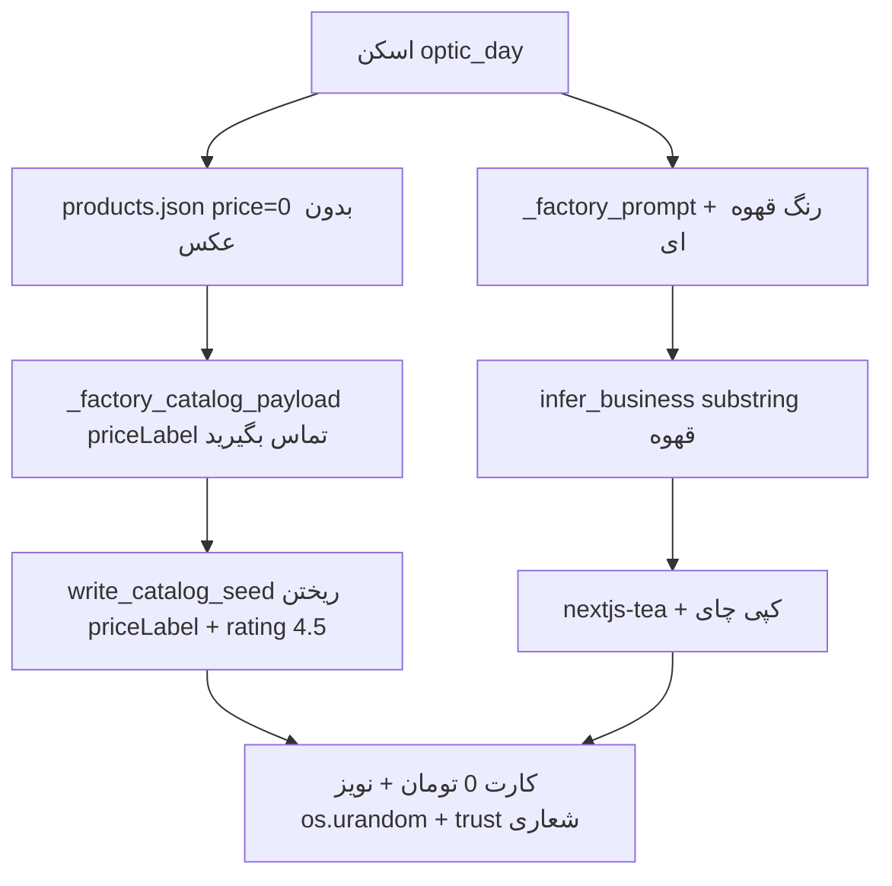

# پلن پچ اسکیل ادز (S1–S4)

**وضعیت:** آمادهٔ اجرا — پس از تأیید عرفان  
**مبنا:** `Sozan-sprint-scale-tech-doc.md` (قفل A+B، ۱۹ سپ ۲۰۲۶) + شواهد زندهٔ `https://darkhshsh-dast-saz.sozan-core.ir` (جاب `fp-1789773343`)  
**اصل:** پچ سیستمی است؛ هیچ ادیت دستی روی بیلد زنده. دو مخزن جدا: `Sozan-Core` و `site-builder`.

---

## حکم

M3 فنی (پیش‌نمایش زنده) پاس است. اسکیل ادز **بسته** می‌ماند تا S1–S4 روی همان URL سبز شوند. ریشه‌ها در کارخانه و هاب‌اند، نه در کپی دستی ویترین دمو.

---

## فاز ۰ — پیش‌نیاز

- [ ] git محلی برای `/home/ubuntu/site-builder` روی هاب (بدون remote): `.gitignore` برای `builds/`, `queue/`, `specs/`, `node_modules/`, `.next/`، سپس baseline commit.
- [ ] snapshot ویترین فعلی در `/tmp/scale-before/` (`/`, `/products`, `catalog.json`).
- [ ] تصمیم قیمت «جلد زیپی» از عرفان: عدد تومان **یا** `hidePrices` + برچسب «استعلام قیمت».

---

## فاز ۱ — S1 تمپلیت (P0)

**ریشه:** `infer_business` کلمهٔ «قهوه» را داخل «قهوه‌ای» می‌بیند → `coffee` → `nextjs-tea`. `site_type_hint()` مقدار خام `'جلد زیپی'` می‌دهد و pin نمی‌شود.

### کارخانه — `tools/sozan_archetype.py`
- حذف بلوک `رنگ‌ها:` / `رنگ‌های دیده‌شده:` از blob قبل از تطبیق + واژه‌های رنگی (`قهوه‌ای، طلایی، نقره‌ای، عسلی، زعفرانی، شیری، کرم`).
- `jewelry` ← `زیورآلات، اکسسوری، بدلیجات، گوشواره، دستبند، گردنبند`.
- `general-store` ← `دست‌ساز، هنری، صنایع دستی`.
- رگرسیون: «قهوه اسپرسو برشته‌کاری» همچنان `coffee`.

### هاب — `channel_scan_service.site_type_hint`
- نگاشت به siteType معتبر؛ ناشناخته → `"general-store"` (pin در `infer_business`).

### تست
- `test_brown_color_is_not_coffee` با پرامپت واقعی `fp-1789773343`.
- `test_handmade_accessories_is_jewelry`.
- `test_real_coffee_still_coffee`.
- hint: `'جلد زیپی'` → `general-store`؛ `'کیف'` → `bags`.

### DoD
`10-archetype.json`: `templateId != nextjs-tea`. HTML خانه و `/products`: صفر `چای|دمنوش|قهوه|برشته|دم‌کردن`.

---

## فاز ۲ — S2 قیمت (P0)

**ریشه:** هاب `priceLabel` می‌فرستد؛ `write_catalog_seed` آن را می‌ریزد؛ کارت بی‌شرط «۰ تومان» چاپ می‌کند. گیت پیش از بیلد نیست.

### کارخانه
- `write_catalog_seed` و `write_public_catalog`: عبور `priceLabel`.
- `templates/_runtime/lib/price-view.ts`: `price > 0` → مبلغ؛ وگرنه `priceLabel || «استعلام قیمت»`.
- اعمال در `ProductCard` / `ProductDetail` / cart / checkout همهٔ تمپلیت‌ها (۱۴ عدد). دکمهٔ سبد برای `price <= 0` غیرفعال.
- اسموک: `nextjs-general-store` و `nextjs-jewelry` قبل از بقیه.

### هاب
- `start_build`: اگر `hidePrices=false` و همهٔ کالاها `price<=0` و `priceNote` خالی → `code=price_missing`، بیلد نزن. استثنا: `revise_only`.
- بنر فارسی در `/shop` و چت.

### DoD
هیچ «۰ تومان» روی ویترین؛ بیلد بی‌قیمت با پیام فارسی برمی‌گردد.

---

## فاز ۳ — S4 اعتماد (P1)

### rating
- `domain_catalog.py`: پیش‌فرض `rating=None`؛ اگر `ratingCount<=0` هر دو حذف شوند.
- `write_catalog_seed` کلید ننویسد.
- `nextjs-electronics` فقط با `ratingCount > 0` ستاره نشان دهد.

### trust
- فیلتر `TRUST_BANNED`: تضمین، صمیمی، هزاران، بهترین، ارقام، ٪.
- رد → جایگزینی با سه کارت A4: تولید با دقت / کیفیت مواد / پشتیبانی نزدیک.
- `_TRUST_BY_BIZ` با همان فیلتر.

### DoD
`catalog.json` بدون rating جعلی. `brand.trust` فقط A4 یا خالی.

---

## فاز ۴ — نویز تصویر (P1)

- بدون `sourceImage`: PNG نویز ننویس؛ `image=""` تا `ProductCover` رندر شود.
- `hero.png` / `brand-logo.png`: PNG تک‌رنگ از پالت (`write_flat_png`)، نه `os.urandom`.
- readiness با `skipImages` و تصویر خالی سبز بماند.

### DoD
کارت کالا کاور تایپوگرافیک است، نه نویز.

---

## فاز ۵ — استقرار و verify

1. تست کارخانه → commit محلی site-builder.
2. rsync هاب + تست `shop_service_test` / `channel_scan_service_test` + restart.
3. بنر فرانت اگر لازم.
4. ثبت قیمت تننت `09111234567` → rebuild از چت.
5. اسکریپت `/tmp/scale-verify.sh` روی همان URL:
   - صفر واژهٔ چای/قهوه
   - بدون «۰ تومان»
   - بدون rating با count صفر
   - بدون «تضمینی|صمیمی»
   - بدون PNG نویزی
   - سبد: `data-cart-count=1`
6. حین بیلد یک پیام چت: رگرسیون گارد GPU1.
7. commit جدا برای Sozan-Core؛ push بعد از توکن GitHub.

فازهای ۱ و ۲ **با هم** به هاب می‌روند.

---

## Won't

- بازنویسی هاردکد چای در `nextjs-tea` (وقتی انتخاب نشود لازم نیست).
- سیستم ریویو واقعی، درگاه/کمیسیون، لندینگ `sozan-core.ir`.
- اسکیل ادز قبل از پاس S1–S4 روی URL زنده.

---

## ورودی لازم از عرفان قبل از فاز ۵

قیمت تومان «جلد زیپی»، یا تأیید `hidePrices` (DoD اسکیل سند عدد > ۰ می‌خواهد؛ بدون عدد فقط مسیر استعلام صادقانه بسته می‌شود).
